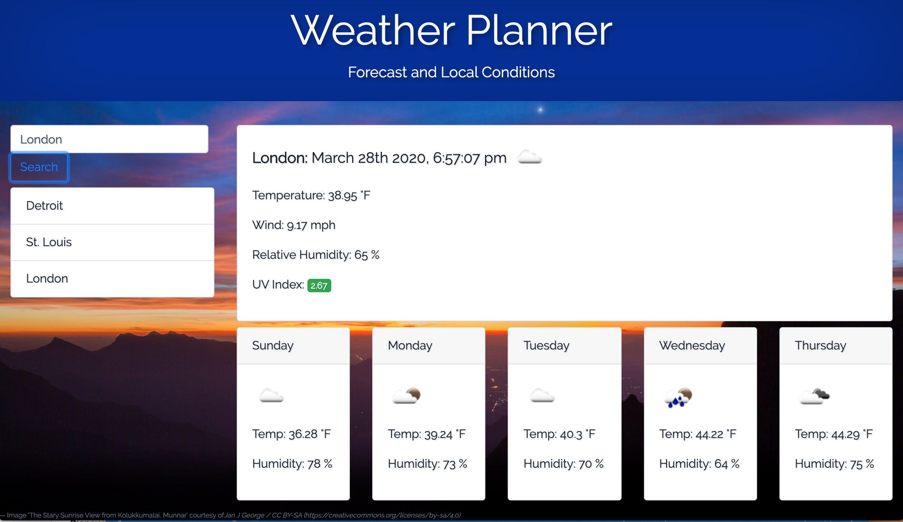

# Weather Planner

Here's a little application that will hopefully come in handy next time you're planning on travelling to another city (or even if you just want a quick way to check the weather at home). Just enter a city into the search field, and the current weather conditions and 5 day forecast will pop up for you. The city and any subsequent entries are stored locally below the search field, so you can come back to the site and find them quickly when needed. The app is [here](https://huelsdonk.github.io/weatherapp/). Happy trails!

